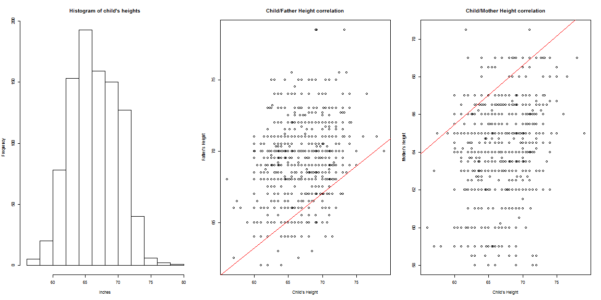

Data Products Project - Predicting Child's Height
========================================================
author: Conrad Wong
date: 10/1/2016


Dataset structure
===


```r
str(GaltonFamilies)
```

```
'data.frame':	934 obs. of  8 variables:
 $ family         : Factor w/ 205 levels "001","002","003",..: 1 1 1 1 2 2 2 2 3 3 ...
 $ father         : num  78.5 78.5 78.5 78.5 75.5 75.5 75.5 75.5 75 75 ...
 $ mother         : num  67 67 67 67 66.5 66.5 66.5 66.5 64 64 ...
 $ midparentHeight: num  75.4 75.4 75.4 75.4 73.7 ...
 $ children       : int  4 4 4 4 4 4 4 4 2 2 ...
 $ childNum       : int  1 2 3 4 1 2 3 4 1 2 ...
 $ gender         : Factor w/ 2 levels "female","male": 2 1 1 1 2 2 1 1 2 1 ...
 $ childHeight    : num  73.2 69.2 69 69 73.5 72.5 65.5 65.5 71 68 ...
```

Child's height histogram
========================================================
width: 1920
height: 1080




Application description
========================================================

- The goal of the application is to predict a child's height based on the expected gender and the parents' height
- The prediction is based on the GaltonFamilies dataset and the general linear model algorithm (glm) from the caret package.
- In the left-hand pane, the user can specify the three variables: father's height, mother's height and expected gender. 
- On the right-hand pane, the application will confirm the values entered by the user and will provide the predicted child's height.  The values will be updated as soon as the user makes any changes to the inputs
- The next slide includes an image of the application.  It can also be accessed in this link: https://cwongg.shinyapps.io/dataproducts/
- The link of the GitHub repository is: xxxx

Application image
========================================================


